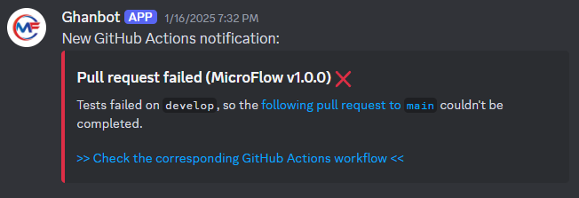
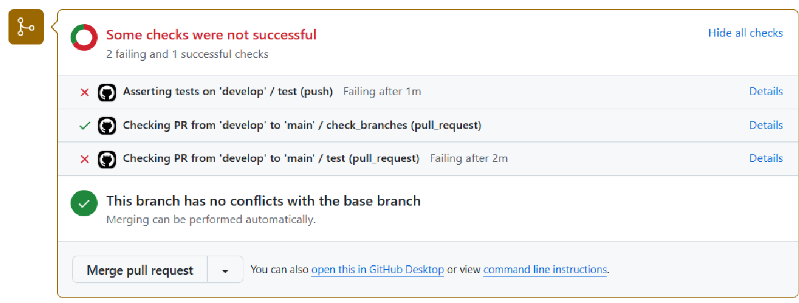

= MicroFlow
:icons: font
:toc: macro
:toclevels: 3
:sectnums:

====
CI/CD industrialization as a microservice architecture fot the MicroFlow project.
====

This document sums up the DevOps strategy and features that have been set up for the efficient development of this project.

toc::[]

== The MicroFlow project

MicroFlow is a really simple application as a microservice project.

It is defined as a simple counter that can be increased or decreased according to the following rules:

* The counter value cannot exceed 10^15 (maximum integer value that JavaScript can handle before data loss)
* The counter value cannot fall behind 0

.The MicroFlow counter set to a pretty suspicious value.

=== Structure

MicroFlow is a frontend only application made with https://angular.dev/[Angular].

A backend was also initially planned but eventually cut due to time constraints.

File structure:

* `link:src/[]`: the frontend source code using TypeScript
* `link:cypress/[]`: <<tests, Cypress tests>>
* `link:Dockerfile[]`: <<docker, the project Dockerfile>>
* `link:.github/workflows/[]`: YML files defining GitHub Actions workflows
* `link:.husky/[]`: <<husky, Husky hook files>>

=== Local installation and commands

Here are the steps to install and run the application (and other commands) on a local environment.

Locally clone this repo, then run `npm i` in a terminal at the project folder root to install dependencies.

Available NPM commands:

* `npm run dev`: locally running the application (accessible at http://localost:4200)
* `npm run test`: running the implemented Cypress tests (requires the app to be locally running)
* `npm run lint`: running <<linting, ESLint to lint the application code>>
* `npm run buid`: building the application into a `dist/browser` folder, use `npm run build \-- \-- --base-href=<url>` to specify the https://angular.dev/tools/cli/deployment#--deploy-url[application base URL]

== Global DevOps strategy

An important aspect of MicroFlow is its DevOps part.

=== Git

https://git-scm.com/[Git] has been chosen for version control as it is the most commonly used tool, also free and open-source.

=== GitHub

https://github.com/[GitHub] has been chosen as it offers a ton of features related to version control and even extra features (issues, organization, rules, teams, workflows, pages, etc).

==== The MicroFlow organization

GitHub offers the possibility to create "organizations" that can be used to centralize repositories, configurations and rules relative to GitHub, to reunite members and to even create teams of members for specific purposes (ex: developer team, reviewer team, etc).

A https://github.com/MicroFlowYnov[MicroFlow organization] has been created to simulate a proper and more complete environment for the MicroFlow project on GitHub.

.The MicroFlow organization on GitHub.

==== The MicroFlow repository

The https://github.com/MicroFlowYnov/MicroFlow[MicroFlow repository] belongs to the MicroFlow organization. It supports different versions of the code between time and branches as well as the latest code releases.

As GitHub allows it, several repository rules have been defined to ensure the proper and efficient management of the code.

The repository also support the GitHub Actions workflows defined to maintain and track changes in an easier and more automated way, as well as releasing and deploying the latest versions of the application.

.The MicroFlow repository on GitHub.
image::doc/images/image-2025-01-19-16-10-53-269.png[]

==== Variables and secrets

GitHub repositories can store variables and secrets that can be used for GitHub Actions workflows:

* Variables: can be set and read by anyone who got access to it, their values are also clearly displayed when executing the different steps defined in a workflow
* Secrets: can only be set by the authorized users, their current values cannot be read and are hidden when executing the different steps defined in a workflow

The following variables have been defined for the MicroFlow repository:

* `DEPLOY_BASE_URL`: the URL where the application can be accessed after being deployed on the staging environment
* `REPO_URL`: the URL of the GitHub repository

As well as the following secrets:

* `DISCORD_WEBHOOK_URL`: the webhook URL provided by Discord to push notifications in a specific channel of a Discord server
* `DOCKER_PASSWORD`: the password to use to push images to the specified Docker Hub repository
* `DOCKER_REPO`: the name of the Docker Hub repository where to push built images
* `DOCKER_USER`: the name of the user owner the Docker Hub repository where to push built images
* `REMOTE_HOST`: the staging server host (address)
* `REMOTE_USER`: the username to use to access the staging server
* `SERVER_DEPLOY_PATH`: the path of the folder where to deploy the application build on the staging server
* `SSH_PRIVATE_KEY`: the private part of the SSH key generated on the staging server to access and deploy the application build on it

==== The MicroFlow DevOps project (backlog)

A https://github.com/orgs/MicroFlowYnov/projects/1[GitHub project] has been created and linked to the MicroFlow project. It contains a backlog with a trace of the issues that have been created to help manage project tasks.

.The MicroFlow project on GitHub.

== Branch and release management

With Git and GitHub, multiple branches can be created so several users can work on different code features at the same time.

A branch strategy defines rules on how to management branches to ensure efficiency, control and integrity.

It is possible to create a "release" from a specific branch which will create a snapshot of the latest code version supposedly stable and usable.

=== Branch strategy

The branch strategy used in the MicroFlow repository is a mix of the https://www.atlassian.com/git/tutorials/comparing-workflows/gitflow-workflow[Git Flow] and the https://docs.github.com/en/get-started/using-github/github-flow[GitHub Flow] strategies.

==== `main`

The `main` branch is the equivalent of the `master` branch used in Git Flow. It is the main repository branch and must support only functional and stable code so releases can be created from it.

Repository rules have been added to "secure" the branch so no code can be directly pushed on it.

.Some settings from the repository rule affecting the `main` branch.

A workflow has also been defined in `link:.github/workflows/main-pr.yml[main-pr.yml]`, triggered when creating a pull request to `main` and ensuring that only the `develop` branch can be merged into it. If that's not the case the pull request will not complete.

.Example of pull request failing as the base branch isn't allowed to merge into `main`.

==== `develop`

As stated above, `develop` is the only branch that can be merged into `main`. It constitutes a base to merge other branches containing new features and fixes. Its code must be clean and functional before creating a pull request to `main` as it is submitted to tests.

==== Other branches

Other branches can be created for many purposes regarding the application, such as working on features, bringing fixes, updating dependencies, etc.

To make things clearer, those branches can be named after the Git Flow strategy, starting with `feature/...` for the ones involving features, `hotfix/...` for the ones involving fixes, etc.

=== Code review and release management

The repository rule applying on `main` has been configured to enable code reviews when creating a pull request to that branch.

A code review implies one or more users (different from the one proposing the changes) approving the pushed code, making suggestions via code comments, etc.

A pull request waiting for a code review can't be completed as long as the code hasn't been approved or if some code comments remain unresolved.

A "Developers" team has been added to the MicroFlow organization, including the members allowed to review code on pull requests.

.The Developers team of the MicroFlow organization.

NOTE: As I'm the only member of the ("fake") MicroFlow organization and the Developers team, I wasn't able to review my own code to complete pull requests to `main`, so I temporarily disabled that prerequisite.

== Collaboration tool

Collaboration is the key to successfully completing projects.

[quote]
Alone, we go faster, together we go further.

It is therefore important to select the right tools that will make collaboration (especially communication), easier and smoother.

=== The MicroFlow Discord server

Discord is a modern and "high-tech" tool for communication. It was originally designed for a more "friendly" and simple purpose but was upgraded and professionalized since Covid and quarantines.

Discord offers the possibility to create community servers where people can chat and share many things. Those servers come in with a lot of features and settings to ensure both control and interactivity.

A https://discord.gg/Uhu45rhs3r[MicroFlow Discord server] has been created with permissions (administration) and different channels to make announcement, ask for help in a develop forum or just tchat about the MicroFlow project.

.The MicroFlow Discord server channels.

=== GitHub Actions notifications

In the MicroFlow Discord server, a "github-actions" channel is dedicated to display notifications related to the GitHub Actions workflows.

This has been achieved by setting up a https://support.discord.com/hc/en-us/articles/228383668-Intro-to-Webhooks[Discord webhook] in the desired channel.

Here are the different notification types that can appear in the channel:

* A "warning" notification is sent when tests fail on code that has just been pushed to `develop`.
+

* "Error" notifications are sent when tests fail on `develop` code when trying to create a pull request to `main` or when code that has just been pushed to `main` couldn't be built or deployed.
+

* A "success" notification is sent when code from `develop` has been merged into `main`, the application has been built and deployed on the staging environment, and a new release has been draft.
+
image::doc/images/image-2025-01-19-17-13-09-304.png[]

== GitHub Actions pipeline [[pipeline]]

The MicroFlow repository manages several workflows, but the one defined in `link:.github/workflows/deploy-release.yml[deploy-release.yml]` is the one used to set up the main project pipeline.

That pipeline is built each time code has been push to `main`, which can only happen when merging code from `develop` via a pull request.

The pipeline in its entirety is split into several jobs executed in a specific order to ensure the integrity and the proper functioning of new released code.

=== Test job

As it is not possible to push code into `main` any other way than by creating a pull request from `develop`, tests aren't run by the previously mentioned workflow but by the one defined in `link:.github/workflows/main-pr.yml[main-pr.yml]`.

This workflow is triggered each time a pull request is created from `develop` to `main` and ensure that:

* It is not possible to create a pull request to `main` from another branch than `develop`
* The pull request can complete only if tests ran on `develop` are passing, if that's not the case, a notification will be sent to the MicroFlow Discord server

In both cases, if the workflow fails, it will not be possible to merge code into `main`, so the main pipeline will not be built again.

.Example of pull request failing as the tests ran on `develop` failed.

image::doc/images/image-2025-01-20-10-06-48-724.png[]

=== Build job

If tests are passing on code from `develop` that has been merged into `main` the first job to be executed in the main pipeline will be the `build` one with the following steps:

* Getting the application version from the `link:package.json[]` file in the project root
* Building the application
* <<docker, Building a Docker image and pushing it to Docker Hub>>
* Archiving the app build as a https://docs.github.com/en/actions/writing-workflows/choosing-what-your-workflow-does/storing-and-sharing-data-from-a-workflow[GitHub artifact]
* Sending a notification in the Discord server if the job fails

=== Deploy job

Once the application has been successfully built, it can be deployed on the staging environment which is what the `deploy` job is doing with the following steps:

* Retrieving the previously created artifact containing the application build
* Deploying the build on the staging server
* Sending a notification in the Discord server if the job fails

=== Release job

After the application has been successfully deployed on the staging environment, the last `draft-release` job creates a new draft release with the following steps:

* Creating a new draft release from the application version to manually complete and publish
* Sending a notification in the Discord server to announce the application has been successfully deployed and a new release has been created

== Docker image management [[docker]]

https://docker.com/Docker[Docker] is a platform designed to help developers build, share, and run container applications.

=== Dockerfile

A `link:Dockerfile[]` has been added at the project root to build a Docker image that will support the application build for local or public deployment.

The file defines the following steps:

* Creating a Nginx environment to run the application build
* Copying the application build
* Exposing the default 80 port so the deployed application can be accessed

=== Pushing images to Docker Hub

https://hub.docker.com/[Docker Hub] is a platform similar to GitHub but for container and image management rather than code. Repositories can be created to store custom containers and images that can be shared between users.

A https://hub.docker.com/repository/docker/tilianh/microflow/general[MicroFlow repository] has been created on Docker Hub to store images and containers built for the project.

.The MicroFlow repository on Docker Hub.

<<pipeline, As previously seen>>, the main GitHub Actions pipeline builds an image from the written Dockerfile using the application build, then pushes it to the related Docker Hub repository so it can be reused later.

== Quality and good practices

Good practices sucha as testing and linting code are useful to keep a project clean and maintainable.

=== Running tests [[tests]]

Cypress is a powerful tool to automatize end-to-end (e2e) testing by simulating a user applying test cases on an interface, or by making requests to web pages.

Cypress tests have been implemented in the `link:cypress/e2e/[]` directory for the application frontend and the originally planned backend, to validate the following use cases:

* Is the application available (is it running and accessible via a URL)
* Can the counter be increased to 10^15 or bellow?
* Can the counter be decreased to 0 or above?

(only the frontend ones are being used)

==== When creating a pull request from `develop` to `main`

When creating a pull request to `main`, the workflow defined in `link:.github/workflows/main-pr.yml[main-pr.yml]` checks that only `develop` can be merged into that branch. If that's the case, the implemented tests are applied on the proposed code. If they fail, the pull request can't be completed and a notification is sent to the MicroFlow Discord server.

image::doc/images/image-2025-01-20-10-06-48-724.png[]

==== When pushing to `develop`

The workflow defined in `link:.github/workflows/test-develop.yml[test-develop.yml]` runs the tests on `develop` each time code is pushed into it. If those fail, a "warning" notification is sent to the Discord server.

.Example of test report generated on the GitHub Actions workflow panel.

=== Code linting [[linting]]

To ensure a minimal code quality within the project, linting tools have been set up.

==== ESLint

https://eslint.org/[ESLint] is a simple yet complete code analysis tool that relies on "rules" to identify flaws.

It has been added to the project and configured to only lint "obvious" errors within the application code such as undeclared variables, syntaxis errors, etc.

Although the current configuration is really basic, it would be possible to set up many more rules to control and prevent specific cases.

==== Husky [[husky]]

https://typicode.github.io/husky/[Husky] is a tool that takes effect when before or after realizing specific git actions such as commiting, pushing, pulling, merging, etc., by running defined scripts.

For instance, the script defined in a `commit-msg` file added in `link:.husky/[]` will be run each time a commit is created via command lines.

** Set up to lint the code when commiting, so if errors were found the commit isn't created
** Ensuring minimal and basic code quality

==== Automatically linting code when commiting

Combined in this repository, Husky ensure that no commit can be created if errors were found in the code linted by ESLint.

.Example of commit failing because an error was found in the code.

